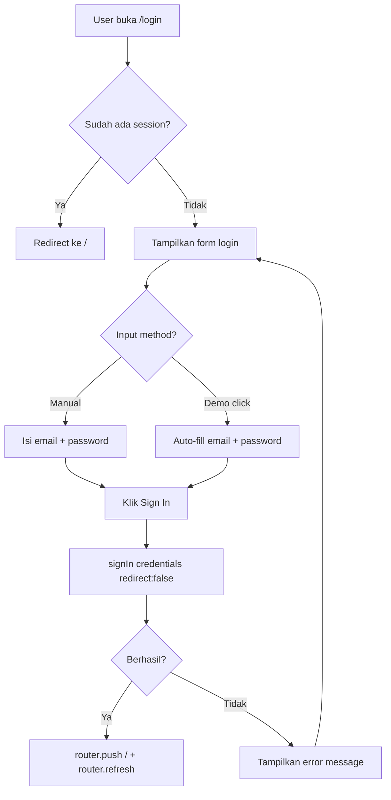

# SRS Modul 02: Authentication (Login)

**Modul:** Authentication
**Route:** `/login`
**Versi:** 2.0
**Terakhir Diperbarui:** Juli 2026
**Implementation Status:** Done — All FR-AUTH fully implemented

---

## 1. Overview

### 1.1 Deskripsi

Modul autentikasi menangani login user, manajemen session, dan enforcement akses untuk seluruh CoalTrade OS. Menggunakan NextAuth.js dengan Credentials Provider untuk autentikasi berbasis email/password.

### 1.2 Route & Dependencies

| Atribut | Nilai |
|---------|-------|
| Route | `/login` |
| Auth Provider | NextAuth.js Credentials Provider |
| Session | JWT-based |
| Database | PostgreSQL via Prisma (User table) |
| Store | `auth-store` |
| Akses | Publik (halaman tanpa autentikasi) |

---

## 2. Functional Requirements

### FR-AUTH-001: Login Form (Status: Done)

**Priority:** Very High

Sistem harus menyediakan halaman login dengan form email dan password.

**Form Elements:**

| Element | Jenis | Validasi |
|---------|-------|----------|
| Email | Input text (type=email) | Required, format email valid |
| Password | Input text (type=password) | Required, min 1 karakter |
| Error Message | Conditional text | "Invalid email or password" |
| Sign In Button | Submit button | Loading spinner saat proses |

**Acceptance Criteria:**
- `AC-AUTH-001`: User dapat login dengan email dan password yang valid
- `AC-AUTH-002`: Error message ditampilkan jika credentials salah
- `AC-AUTH-003`: Loading spinner ditampilkan selama proses autentikasi
- `AC-AUTH-004`: Setelah login berhasil, redirect ke `/` (Dashboard)

---

### FR-AUTH-002: Demo Accounts (Status: Done)

**Priority:** Low

Halaman login menampilkan daftar akun demo untuk kemudahan testing.

**Demo accounts clickable** — klik auto-fill email dan password.

**Acceptance Criteria:**
- `AC-AUTH-005`: Klik demo account mengisi email dan password secara otomatis
- `AC-AUTH-006`: Daftar demo account ditampilkan di bawah form login

---

### FR-AUTH-003: JWT Session Management (Status: Done)

**Priority:** Very High

Sistem menggunakan JWT-based session melalui NextAuth.js.

**Session Data:**
- User ID
- User Name
- User Email
- User Role

**Acceptance Criteria:**
- `AC-AUTH-007`: Session valid setelah login berhasil
- `AC-AUTH-008`: Session tersedia via `useSession()` hook di seluruh aplikasi
- `AC-AUTH-009`: Session menyimpan role user untuk RBAC enforcement

---

### FR-AUTH-004: Protected Routes (Status: Done)

**Priority:** Very High

Semua route selain `/login` memerlukan session aktif.

**Business Rules:**
- `BR-AUTH-001`: User tanpa session aktif di-redirect ke `/login`
- `BR-AUTH-002`: Session expired di-redirect ke `/login`
- `BR-AUTH-003`: Role check dilakukan per halaman sesuai RBAC

**Acceptance Criteria:**
- `AC-AUTH-010`: Akses ke route protected tanpa session → redirect `/login`
- `AC-AUTH-011`: Akses ke route restricted tanpa role yang sesuai → tampilkan "Access Restricted"

---

### FR-AUTH-005: Logout (Status: Done)

**Priority:** High

User dapat logout dari sistem.

**Acceptance Criteria:**
- `AC-AUTH-012`: Klik logout menghapus session dan redirect ke `/login`
- `AC-AUTH-013`: Setelah logout, akses ke route protected di-redirect ke `/login`

---

## 3. Data Model

### 3.1 Entity: User

| Field | Type | Required | Keterangan |
|-------|------|----------|------------|
| id | UUID | Yes | Primary key |
| name | String | Yes | Nama lengkap |
| email | String | Yes | Email login (unique) |
| password | String | Yes | Hashed password |
| role | Enum | Yes | Role RBAC |
| createdAt | DateTime | Yes | Auto-generated |
| updatedAt | DateTime | Yes | Auto-updated |

### 3.2 Role Enum

```
CEO, DIRUT, ASS_DIRUT, COO, CMO, CPPO,
TRADERS_1, TRADERS_2, TRADERS_3, TRADERS_4,
JUNIOR_TRADER, ADMIN_MARKETING,
TRAFFIC_HEAD, TRAFFIC_1, TRAFFIC_2, TRAFFIC_3, TRAFFIC_4,
ADMIN_OPERATION,
SPV_SOURCING, SOURCING_1, SOURCING_2, SOURCING_3, SOURCING_4,
QQ_MANAGER, QC_MANAGER, QC_ADMIN_1, QC_ADMIN_2,
FINANCE, STAFF
```

---

## 4. UI Layout

```
┌──────────────────────────────────────────┐
│              (background abu-abu)        │
│                                          │
│     ┌──────────────────────────┐         │
│     │     🔒 (Logo Circle)     │         │
│     │    Indigo-600, gembok    │         │
│     │                          │         │
│     │     "Business OS"        │         │
│     │  "Sign in to your acc."  │         │
│     │                          │         │
│     │  ┌──────────────────┐    │         │
│     │  │ Email            │    │         │
│     │  └──────────────────┘    │         │
│     │  ┌──────────────────┐    │         │
│     │  │ Password         │    │         │
│     │  └──────────────────┘    │         │
│     │                          │         │
│     │  ❌ Error message        │         │
│     │                          │         │
│     │  ┌──────────────────┐    │         │
│     │  │   Sign in        │    │         │
│     │  └──────────────────┘    │         │
│     │                          │         │
│     │  Demo accounts:          │         │
│     │  • admin@demo.com ****   │         │
│     │  • ceo@demo.com ****     │         │
│     └──────────────────────────┘         │
│                                          │
└──────────────────────────────────────────┘
```

---

## 5. Business Rules

| ID | Rule | Enforcement |
|----|------|-------------|
| BR-AUTH-001 | User tanpa session → redirect /login | Middleware |
| BR-AUTH-002 | Session expired → redirect /login | NextAuth callback |
| BR-AUTH-003 | Role check per halaman | Server + Client guard |
| BR-AUTH-004 | Password disimpan dalam bentuk hash | bcrypt/argon2 |
| BR-AUTH-005 | Login attempt logging | Audit trail |

---

## 6. User Flow



---

## 7. API Endpoints

| Method | Endpoint | Deskripsi |
|--------|----------|-----------|
| POST | `/api/auth/callback/credentials` | NextAuth credential verification |
| GET | `/api/auth/session` | Get current session |
| POST | `/api/auth/signout` | Sign out user |

---

## 8. Role & Permission

| Aksi | Siapa |
|------|-------|
| Akses halaman `/login` | Semua (public) |
| Login | Semua user terdaftar |
| Lihat demo accounts | Semua (public) |

---

## 9. Validation Rules

| Rule | Detail |
|------|--------|
| VR-AUTH-001 | Email wajib diisi dan format valid |
| VR-AUTH-002 | Password wajib diisi |
| VR-AUTH-003 | Email case-insensitive untuk matching |

---

## 10. Integration Points

| Modul Terkait | Jenis Hubungan |
|---------------|----------------|
| Semua modul | Session user digunakan untuk RBAC dan permission check |
| auth-store | `useAuthStore()` menyimpan currentUser dari session |
| User Management | Role yang diatur di `/users` mempengaruhi akses |
| Audit Logs | Login activity dicatat |

---

## 11. Acceptance Criteria Summary

| ID | Criteria | Priority |
|----|----------|----------|
| AC-AUTH-001 | Login berhasil dengan credentials valid | Very High |
| AC-AUTH-002 | Error message saat credentials salah | Very High |
| AC-AUTH-010 | Protected route redirect tanpa session | Very High |
| AC-AUTH-011 | Role-restricted page menampilkan Access Restricted | Very High |

---

## 12. Edge Cases & Error Handling

| Skenario | Handling |
|----------|---------|
| Email tidak terdaftar | Tampilkan generic error "Invalid email or password" |
| Password salah | Tampilkan generic error (same as above, no info leak) |
| Network error saat login | Tampilkan "Connection error, please try again" |
| Session expired saat di halaman | Auto-redirect ke /login |
| Multiple login tabs | Session shared via cookie |
| Role user diubah saat sedang login | Perubahan berlaku setelah re-login |

---

*End of SRS_02_Authentication*
