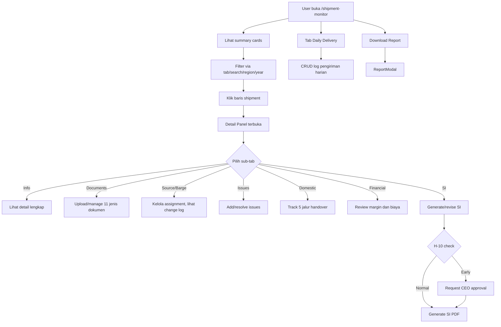
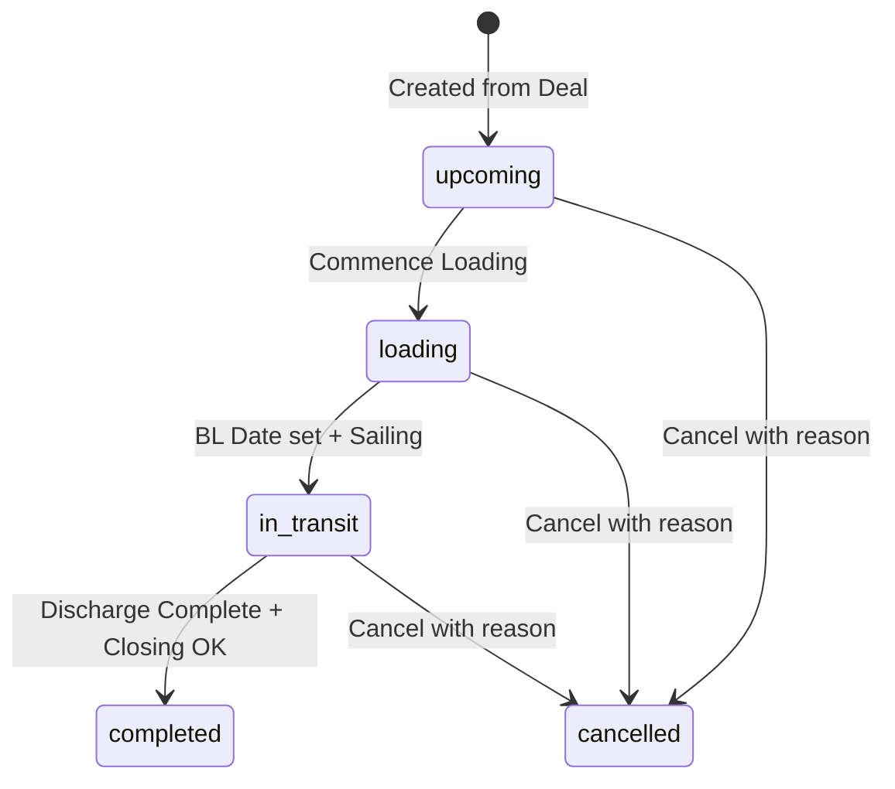

# SRS Modul 03: Shipment Monitor

**Modul:** Shipment Monitor
**Route:** `/shipment-monitor`
**Versi:** 2.0
**Terakhir Diperbarui:** Juli 2026
**Implementation Status:** Partial — MV workspace dan Child Nomination foundation implemented; migration/data reconciliation, full parent-only legacy filtering, and AI Risk Analysis remain pending.

**Correction (EXEC-051):** Document checklist/status was already present, but multi-file attachment per requirement was only finalized in EXEC-051 via `DocumentFile`. This is still URL-backed storage; binary upload/object storage remains a later production-grade step.

---

## 1. Overview

### 1.1 Deskripsi

**Modul terbesar di seluruh aplikasi.** Shipment Monitor adalah pusat pengelolaan pengiriman batubara yang mencakup seluruh siklus hidup shipment — dari perencanaan hingga closing. Modul ini menggabungkan tracking operasional, manajemen dokumen, financial analysis, quality monitoring, source/barge traceability, dan shipping instruction dalam satu interface.

### 1.2 Tujuan

> Shipment Monitor harus menjadi **operational control center**, bukan satu tabel Excel panjang. Modul harus dibagi ke sub-tab atau section workflow yang jelas.

### 1.3 Route & Dependencies

| Atribut | Nilai |
|---------|-------|
| Route | `/shipment-monitor` |
| Store | `commercial-store`, `daily-delivery-store` |
| Dependencies | Recharts, jsPDF, AI Agent, Pagination |
| Akses | Semua role (write berdasarkan RBAC) |

---

## 2. Functional Requirements

### FR-SHIP-001: Shipment List dengan Status Tabs (Status: Done)

**Priority:** Very High

Sistem harus menampilkan daftar shipment dengan filter tab berdasarkan status.

**Tab Bar (7 tab):**

| Tab | Filter | Deskripsi |
|-----|--------|-----------|
| All | Semua status | Seluruh shipment |
| Upcoming | status = upcoming | Shipment yang belum dimulai |
| Loading | status = loading | Sedang proses pemuatan |
| In Transit | status = in_transit | Dalam perjalanan |
| Completed | status = completed | Sudah selesai |
| Cancelled | status = cancelled | Dibatalkan |
| Daily Delivery | Tab terpisah | Log pengiriman harian |

**Search dan Filter Bar:**

| Filter | Jenis | Fungsi |
|--------|-------|--------|
| Search | Text Input | Cari buyer, vessel, barge, project |
| Region | Dropdown | Filter wilayah |
| Year | Dropdown | Filter tahun |

**Acceptance Criteria:**
- `AC-SHIP-001`: Klik tab memfilter shipment berdasarkan status
- `AC-SHIP-002`: Search memfilter secara real-time (debounce 250ms)
- `AC-SHIP-003`: Multiple filter dapat dikombinasikan

---

### FR-SHIP-002: Summary Cards (Status: Done)

**Priority:** High

Metrik per status yang menampilkan:
- Total count per status
- Total volume per status
- Total value per status

**Acceptance Criteria:**
- `AC-SHIP-004`: Summary cards ter-update saat filter berubah

---

### FR-SHIP-003: Shipment Data Table (Status: Done)

**Priority:** Very High

| Kolom | Deskripsi |
|-------|-----------|
| No | Nomor urut |
| Shipment No / Project Name | ID atau nama proyek |
| Status | Badge berwarna (Upcoming/Loading/In Transit/Completed/Cancelled) |
| Buyer | Nama pembeli |
| Vessel/Barge | Nama kapal dan tongkang |
| Loading Port | Pelabuhan muat |
| Qty Plan | Kuantitas yang direncanakan (MT) |
| Qty Loaded | Kuantitas yang dimuat (MT) |
| BL Date | Tanggal Bill of Lading |
| Laycan | Periode laycan |
| Source | Sumber batubara |
| Sell Price | Harga jual per MT (USD) |
| Buy Price | Harga beli per MT (USD) |
| Margin | Selisih sell - buy per MT |
| Completion % | Data completeness score |
| Actions | Edit, Delete, View Detail |

**Pagination Controls:** Page, Page Size (10/25/50/100), Navigasi

**Acceptance Criteria:**
- `AC-SHIP-005`: Setiap baris bisa diklik → membuka Detail Panel
- `AC-SHIP-006`: Pagination berfungsi dengan page size selector
- `AC-SHIP-007`: Sell Price, Buy Price, Margin **hanya visible** untuk executive role

---

### FR-SHIP-004: Shipment Detail Panel — Info Tab (Status: Done)

**Priority:** Very High

Detail lengkap shipment saat baris diklik:

| Section | Fields |
|---------|--------|
| Buyer Info | Nama buyer, negara |
| Vessel & Route | Vessel name, barge name, POL, POD |
| Schedule | Laycan dates, ETA, ETD, BL Date |
| Quantity | Qty plan, qty loaded |
| Pricing | Sell price, buy price, freight, margin |
| Coal Spec | GAR, TS, ASH, TM |
| Status | Current status, completion score |

**Acceptance Criteria:**
- `AC-SHIP-008`: Detail panel menampilkan semua field shipment
- `AC-SHIP-009`: Field pricing restricted untuk non-executive

---

### FR-SHIP-005: Detail Panel — Documents Tab (Status: Done)

**Priority:** Very High

Checklist 11 jenis dokumen wajib per shipment:

| Kode | Dokumen |
|------|---------|
| a | Copy Laporan Hasil Verifikasi (LHV) |
| b | 1 Original Draught Survey Report |
| c | 1 Original Surat Keterangan Asal Barang |
| d | 1 Original Surat Kebenaran Dokumen |
| e | 1 Original Surat Kirim Barang |
| f | 1 Original Bukti Bayar Royalti |
| g | 3/3 Original Bill of Lading |
| h | 3/3 Copies Non Negotiable Bill of Lading |
| i | Certificate of Sampling and Analysis |
| j | Certificate of Weight |
| k | Certificate of Draught Survey Report |

**Per dokumen:**
- Status: `Pending | Received | Submitted | Completed | Not Required`
- Tombol **Upload** (accept: image, PDF, DOCX)
- Tombol **View/Download** jika sudah diupload
- PIC/Owner assignment
- Notes field
- **Received date** — tanggal diterima
- **Submitted date** — tanggal disubmit
- **Aging days** — dihitung otomatis dari received date

**Business Rules:**
- `BR-SHIP-001`: Mandatory docs harus lengkap sebelum shipment bisa closed
- `BR-SHIP-002`: Aging dihitung otomatis: `today - received_date` (hari)
- `BR-SHIP-003`: Aging > 30 hari = Critical alert
- `BR-SHIP-004`: Aging 15-30 hari = Warning alert
- `BR-SHIP-005`: Hardcopy status terpisah dari softcopy upload status

**Acceptance Criteria:**
- `AC-SHIP-010`: User dapat upload dokumen per checklist item
- `AC-SHIP-011`: User dapat view/download dokumen yang sudah diupload
- `AC-SHIP-012`: Aging dihitung otomatis dan ditampilkan per dokumen
- `AC-SHIP-013`: Incomplete mandatory docs memblokir closing

---

### FR-SHIP-006: Detail Panel — Source & Barge Management (Status: Done)

**Priority:** Very High

**Source Assignment:**
- Current source/supplier info
- Source change request → Source Change Traceability
- History log perubahan source

**Barge Assignment:**
- Current MV/TB/BG info
- Barge change request → Barge Change Log
- History log perubahan barge

**Acceptance Criteria:**
- `AC-SHIP-014`: Source dan barge assignment visible di detail panel
- `AC-SHIP-015`: Perubahan source/barge membuat log entry baru (no overwrite)

---

### FR-SHIP-007: Source Change Traceability (Status: Done)

**Priority:** Very High

| Field | Type | Required |
|-------|------|----------|
| Shipment ID | FK | Yes |
| Current Source | String | Yes |
| Current Supplier | String | Yes |
| New Source | String | Yes |
| New Supplier | String | Yes |
| Requested By | FK (User) | Yes |
| Request Date | DateTime | Yes |
| Reason Category | Enum | Yes |
| Reason Detail | Text | Yes |
| Evidence Upload | File | Yes if issue |
| Impact Description | Text | Yes |
| CEO Approval Status | Enum | Yes |
| New Source Contract Status | Enum | Yes |
| Active Source Version | Number | Yes |

**Reason Categories:** Stock issue, Quality issue, Price issue, Legal issue, Logistics issue, Buyer request, Other

**Business Rules:**
- `BR-SHIP-006`: Source lama tetap tersimpan (no overwrite)
- `BR-SHIP-007`: New source aktif **hanya** jika: reason terisi, evidence tersedia, CEO approved, contract status active
- `BR-SHIP-008`: CEO approval status tercatat dengan user, timestamp, comment
- `BR-SHIP-009`: Active source version jelas (latest version number)
- `BR-SHIP-010`: Dashboard menampilkan pending source change

**Acceptance Criteria:**
- `AC-SHIP-016`: Source lama tetap tersimpan saat change
- `AC-SHIP-017`: New source tidak aktif sebelum semua rule terpenuhi
- `AC-SHIP-018`: History perubahan source dapat dilihat chronologically

---

### FR-SHIP-008: Barge Change Log (Status: Done)

**Priority:** Very High

| Field | Type | Required |
|-------|------|----------|
| Shipment ID | FK | Yes |
| Old MV/TB/BG | String | Yes |
| New MV/TB/BG | String | Yes |
| Change DateTime | DateTime | Yes |
| Changed By | FK (User) | Yes |
| Department | String | Yes |
| Reason Category | Enum | Yes |
| Reason Detail | Text | Yes |
| Evidence Upload | File | Optional |
| Approval Required | Boolean | Yes |
| Approved By | FK (User) | Conditional |
| Status | Enum | Yes |

**Status Values:** `active`, `rejected`, `cancelled`, `superseded`

**Business Rules:**
- `BR-SHIP-011`: Perubahan nomination tidak overwrite data lama
- `BR-SHIP-012`: Latest active nomination dapat dilihat
- `BR-SHIP-013`: Domestic final TB/BG dimiliki Sales/Traffic (bukan Source Team)
- `BR-SHIP-014`: Source dan Quality diberi notice jika change berdampak ke schedule/cargo/quality

**Acceptance Criteria:**
- `AC-SHIP-019`: Barge change membuat entry baru
- `AC-SHIP-020`: History semua perubahan dapat dilihat
- `AC-SHIP-021`: Latest active nomination ditandai jelas

---

### FR-SHIP-009: Issues Log (Status: Done)

**Priority:** High

| Field | Type | Required |
|-------|------|----------|
| Issue Category | Enum | Yes |
| Description | Text | Yes |
| Impact | Text | Yes |
| Action Plan | Text | Yes |
| PIC | FK (User) | Yes |
| Target Date | Date | Yes |
| Status | Enum | Yes |
| Evidence | File | Conditional |

**Issue Categories:** Loading delay, Quality issue, Barge issue, Document issue, Payment issue, Weather, Port issue, Other

**Business Rules:**
- `BR-SHIP-015`: Issue/Hold/Cancelled status **wajib reason**
- `BR-SHIP-016`: Open issue tampil di Dashboard Blocker
- `BR-SHIP-017`: Closing diblokir jika issue belum clear atau belum punya reason

**Acceptance Criteria:**
- `AC-SHIP-022`: User dapat add, resolve, update issue
- `AC-SHIP-023`: Status wajib reason saat di-set ke Hold/Cancelled

---

### FR-SHIP-010: Domestic Document Handover (Status: Done)

**Priority:** High

5 jalur tracking dokumen domestik:

| Track | Alur |
|-------|------|
| SKAB | Supplier → Operation → Traffic → Finance |
| DSR | Supplier → Operation → Traffic |
| BL/CM | Operation → Traffic → Finance |
| COA POL | Surveyor → Traffic → Finance |
| COA POD | Quality → Finance → Vendor → Approval DT → Paid |

**Per track menampilkan:**
- Status setiap stage (tanggal received/sent)
- **Stuck indicator** — di mana proses terhenti
- **Aging days** — berapa lama stuck

**Business Rules:**
- `BR-SHIP-018`: Setiap tahap punya tanggal perpindahan
- `BR-SHIP-019`: Aging per tahap dihitung otomatis
- `BR-SHIP-020`: Dashboard menampilkan dokumen domestik yang stuck

**Acceptance Criteria:**
- `AC-SHIP-024`: Setiap track menampilkan pipeline visual
- `AC-SHIP-025`: Stuck indicator menunjukkan pihak yang menahan dokumen

---

### FR-SHIP-011: Financial Tab (Status: Done)

**Priority:** High

| Field | Deskripsi |
|-------|-----------|
| Sell Price (USD/MT) | Harga jual |
| Buy Price (USD/MT) | Harga beli |
| Freight Rate | Biaya freight |
| Royalty Cost | Biaya royalti |
| Tax/Export Cost | Pajak/biaya ekspor |
| Survey Cost | Biaya survei |
| Finance Cost | Biaya finance |
| Total Cost per MT | Total biaya per MT |
| Margin per MT | Selisih sell - total cost |
| Total Margin | Margin × qty |

**Business Rules:**
- `BR-SHIP-021`: Financial data **restricted** — hanya executive role
- `BR-SHIP-022`: Data financial feed ke P&L module

**Acceptance Criteria:**
- `AC-SHIP-026`: Financial tab hidden untuk non-executive
- `AC-SHIP-027`: Kalkulasi margin otomatis

---

### FR-SHIP-012: Shipping Instruction (SI) (Status: Done)

**Priority:** Very High

| Field | Type | Required |
|-------|------|----------|
| SI Number | String (auto) | Yes |
| SI Version | Number | Yes |
| Shipment ID | FK | Yes |
| Forecast Sales ID | FK | Yes |
| Buyer | String | Yes |
| Supplier | String | Yes |
| Source | String | Yes |
| POL | String | Yes |
| POD | String | Yes |
| Laycan | DateRange | Yes |
| Product | String | Yes |
| Coal Spec | JSON | Yes |
| Quantity | Number | Yes |
| Tolerance | String | Optional |
| Vessel/Barge | String | Yes |
| Contract Reference | String | Yes |
| Document Required | Text | Optional |
| Remarks | Text | Optional |
| Approval Status | Enum | Yes |
| PDF Output | File | Generated |

**Business Rules:**
- `BR-SHIP-023` (H-10 Rule): Normal SI hanya boleh issued **minimal H-10** dari first day laycan
- `BR-SHIP-024`: Early SI (sebelum H-10) **wajib CEO approval/acknowledgment** dengan reason
- `BR-SHIP-025`: SI revision membuat **version baru** (no overwrite)
- `BR-SHIP-026`: SI revision **wajib** reason, evidence, CEO approval
- `BR-SHIP-027`: SI cancellation **wajib** reason, evidence, CEO acknowledgment
- `BR-SHIP-028`: Old SI version tetap tersimpan
- `BR-SHIP-029`: SI PDF digenerate dari data shipment (bukan upload manual)

**Acceptance Criteria:**
- `AC-SHIP-028`: SI number auto-generated dan unique
- `AC-SHIP-029`: SI PDF dapat digenerate dari data shipment
- `AC-SHIP-030`: H-10 rule enforcement (warning + approval flow)
- `AC-SHIP-031`: Revision history dengan version tracking
- `AC-SHIP-032`: Old SI version accessible di history

---

### FR-SHIP-013: POL Timeline (Status: Done)

**Priority:** High

| Milestone | Field |
|-----------|-------|
| Arrive POL | DateTime |
| NOR POL | DateTime |
| Berthing | DateTime |
| Commence Loading | DateTime |
| Complete Loading | DateTime |
| BL Date | Date |
| PEB | String/Date |
| LHV | String/Date |

**Acceptance Criteria:**
- `AC-SHIP-033`: Shipment status auto-update berdasarkan milestone dates

---

### FR-SHIP-014: POD Timeline (Status: Done)

**Priority:** High

| Milestone | Field |
|-----------|-------|
| ETA POD | DateTime |
| Arrive POD | DateTime |
| NOR POD | DateTime |
| In Position | DateTime |
| Discharge Start | DateTime |
| Discharge Complete | DateTime |
| Factory Date | DateTime |

**Business Rules:**
- `BR-SHIP-030`: Late POD days dihitung otomatis dari ETA vs actual arrive

---

### FR-SHIP-015: Closing Checklist (Status: Done — 7 of 8 checks implemented: final_qty, bl_date, mandatory docs, open issues, SI approval, quality status, payment overdue)

**Priority:** Very High

Shipment **tidak boleh closed** jika:

| Check | Mandatory |
|-------|-----------|
| Final quantity sudah ada | Yes |
| Mandatory documents lengkap | Yes |
| Quality data final tersedia | Yes |
| Quality warning sudah reviewed | Yes |
| Payment status sesuai rule | Yes |
| SI/revision status clear | Yes |
| Issue/hold/cancelled punya reason | Yes |
| Open issues sudah resolved | Yes |

**Business Rules:**
- `BR-SHIP-031`: Closing diblokir jika **any** mandatory check gagal
- `BR-SHIP-032`: Sistem menampilkan checklist items yang belum terpenuhi
- `BR-SHIP-033`: Closing action hanya bisa dilakukan oleh authorized role

**Acceptance Criteria:**
- `AC-SHIP-034`: Closing checklist ditampilkan saat attempt close
- `AC-SHIP-035`: Tombol close disabled jika ada check gagal
- `AC-SHIP-036`: Alasan block ditampilkan per check item

---

### FR-SHIP-016: Shipment Data Completeness Score (Status: Done)

**Priority:** High

Field group yang dihitung:

| Group | Fields |
|-------|--------|
| Header Identity | Shipment ID, Forecast Sales ref, buyer, type, PIC |
| Commercial | Sales price, buying price, quantity, payment term, shipping term |
| Source | Supplier/source, IUP OP, origin, stock/COB, readiness |
| Route & Schedule | POL, POD, laycan, vessel/barge/nomination |
| Quality | Requested spec, latest actual/estimated spec |
| SI | SI data fields and status |
| Documents | Required document checklist |
| Payment | Invoice/payment status |
| Issue/Closing | Open issue, reason, final quantity |

**Business Rules:**
- `BR-SHIP-034`: Placeholder values (`-`, `0`, `N/A`, empty) **tidak dihitung** sebagai valid
- `BR-SHIP-035`: Completion percentage = (filled valid fields / total required fields) × 100
- `BR-SHIP-036`: Score dipakai monitoring, closing tetap pakai checklist validation

**Acceptance Criteria:**
- `AC-SHIP-037`: Setiap shipment menampilkan completion percentage
- `AC-SHIP-038`: User dapat melihat daftar missing/weak fields
- `AC-SHIP-039`: Mandatory field kosong menurunkan score dan memberi warning

---

### FR-SHIP-017: Daily Delivery Log (Status: Done)

**Priority:** Medium

| Kolom | Deskripsi |
|-------|-----------|
| BL Date | Tanggal BL |
| Buyer | Pembeli |
| Supplier | Pemasok |
| Shipping Term | FOB/CIF/CFR |
| Area | Wilayah |
| Flow | Domestic/Export |
| BL Qty | Kuantitas BL |
| Invoice Amount | Nilai invoice |
| Product | Jenis produk |
| Project | Nama proyek |

**CRUD Operations:** Add, Edit, Delete
**Pagination terpisah dari main shipment table**

**Acceptance Criteria:**
- `AC-SHIP-040`: CRUD operations untuk daily delivery log
- `AC-SHIP-041`: Data dari store terpisah (`daily-delivery-store`)

---

### FR-SHIP-018: Commercial Reference (Status: Done — /api/shipments/:id/commercial-reference GET + "Commercial Ref" tab in detail drawer)

**Priority:** High

Link ke dokumen komersial terkait:
- FCO/MoM/PO reference
- Contract number
- Shipping term
- Price
- Invoice amount
- Payment term
- Bank info

**Business Rules:**
- `BR-SHIP-037`: Link to Forecast Sales/Sales documents (no re-upload)
- `BR-SHIP-038`: Data feed ke Payment dan P&L

**Acceptance Criteria:**
- `AC-SHIP-042`: Commercial reference menampilkan linked docs
- `AC-SHIP-043`: Data dari Forecast Sales terbawa ke shipment

---

### FR-SHIP-019: Report Export (Status: Done)

**Priority:** Medium

Export laporan shipment via ReportModal.

**Acceptance Criteria:**
- `AC-SHIP-044`: User dapat download report dalam format yang dipilih

---

### FR-SHIP-020: AI Risk Analysis (Status: Pending — not implemented in Shipment Monitor; only available in Transshipment as stub)

**Priority:** Medium

AI risk assessment per shipment.

**Acceptance Criteria:**
- `AC-SHIP-045`: AI analysis memberikan risk score dan rekomendasi

---

## 3. Data Model

### 3.1 Entity: Shipment

| Field | Type | Required | Keterangan |
|-------|------|----------|------------|
| id | UUID | Yes | Primary key |
| shipmentNumber | String | Yes | Auto-generated, unique |
| projectId | FK (Project) | Optional | Link ke Forecast Sales |
| type | Enum (export/domestic) | Yes | Tipe shipment |
| buyer | String | Yes | Nama buyer |
| buyerCountry | String | Optional | Negara buyer |
| product | String | Yes | Komoditas |
| qtyPlan | Number | Yes | Kuantitas rencana (MT) |
| qtyLoaded | Number | Optional | Kuantitas dimuat (MT) |
| qtyFinal | Number | Optional | Kuantitas final (MT) |
| salesPrice | Number | Optional | Harga jual USD/MT |
| buyingPrice | Number | Optional | Harga beli USD/MT |
| freightRate | Number | Optional | Freight USD/MT |
| marginMt | Number | Optional | Margin per MT |
| pol | String | Optional | Port of Loading |
| pod | String | Optional | Port of Discharge |
| laycanStart | Date | Optional | Laycan mulai |
| laycanEnd | Date | Optional | Laycan akhir |
| vesselName | String | Optional | Nama MV |
| bargeName | String | Optional | Nama barge (TB/BG) |
| source | String | Optional | Source batubara |
| supplier | String | Optional | Supplier |
| iupOp | String | Optional | IUP OP number |
| specGar | Number | Optional | GAR |
| specTs | Number | Optional | TS (%) |
| specAsh | Number | Optional | ASH (%) |
| specTm | Number | Optional | TM (%) |
| status | Enum | Yes | Status shipment |
| pic | String | Optional | PIC trader |
| blDate | Date | Optional | BL Date |
| region | String | Optional | Region |
| completionScore | Number | Computed | Data completeness % |
| createdAt | DateTime | Yes | Auto |
| updatedAt | DateTime | Yes | Auto |

**Status Enum:** `upcoming`, `loading`, `in_transit`, `completed`, `cancelled`

### 3.2 Entity: ShipmentDocument

| Field | Type | Required |
|-------|------|----------|
| id | UUID | Yes |
| shipmentId | FK | Yes |
| requirementCode | String | Yes |
| label | String | Yes |
| status | Enum | Yes |
| receivedDate | Date | Optional |
| submittedDate | Date | Optional |
| submittedTo | String | Optional |
| agingDays | Number | Computed |
| fileUrl | String | Optional |
| fileName | String | Optional |
| fileSize | Number | Optional |
| hardcopyStatus | String | Optional |
| owner | String | Optional |
| pic | String | Optional |
| notes | Text | Optional |
| uploadedBy | String | Optional |
| uploadedAt | DateTime | Optional |

### 3.3 Entity: SourceChangeLog

| Field | Type | Required |
|-------|------|----------|
| id | UUID | Yes |
| shipmentId | FK | Yes |
| currentSource | String | Yes |
| currentSupplier | String | Yes |
| newSource | String | Yes |
| newSupplier | String | Yes |
| requestedBy | FK (User) | Yes |
| requestDate | DateTime | Yes |
| reasonCategory | Enum | Yes |
| reasonDetail | Text | Yes |
| evidenceFileUrl | String | Optional |
| impactDescription | Text | Yes |
| ceoApprovalStatus | Enum | Yes |
| ceoApprovedBy | FK (User) | Optional |
| ceoApprovedAt | DateTime | Optional |
| ceoComment | Text | Optional |
| newContractStatus | Enum | Yes |
| activeVersion | Number | Yes |

### 3.4 Entity: BargeChangeLog

| Field | Type | Required |
|-------|------|----------|
| id | UUID | Yes |
| shipmentId | FK | Yes |
| oldBarge | String | Yes |
| newBarge | String | Yes |
| changeDatetime | DateTime | Yes |
| changedBy | FK (User) | Yes |
| department | String | Yes |
| reasonCategory | Enum | Yes |
| reasonDetail | Text | Yes |
| evidenceFileUrl | String | Optional |
| approvalRequired | Boolean | Yes |
| approvedBy | FK (User) | Optional |
| status | Enum | Yes |

### 3.5 Entity: ShipmentIssue

| Field | Type | Required |
|-------|------|----------|
| id | UUID | Yes |
| shipmentId | FK | Yes |
| category | Enum | Yes |
| description | Text | Yes |
| impact | Text | Yes |
| actionPlan | Text | Yes |
| pic | FK (User) | Yes |
| targetDate | Date | Yes |
| status | Enum | Yes |
| evidenceFileUrl | String | Optional |
| resolvedAt | DateTime | Optional |
| resolvedBy | FK (User) | Optional |

### 3.6 Entity: ShippingInstruction

| Field | Type | Required |
|-------|------|----------|
| id | UUID | Yes |
| siNumber | String (auto) | Yes |
| version | Number | Yes |
| shipmentId | FK | Yes |
| forecastSalesId | FK | Optional |
| buyer | String | Yes |
| supplier | String | Yes |
| source | String | Yes |
| pol | String | Yes |
| pod | String | Yes |
| laycanStart | Date | Yes |
| laycanEnd | Date | Yes |
| product | String | Yes |
| coalSpec | JSON | Yes |
| quantity | Number | Yes |
| tolerance | String | Optional |
| vesselBarge | String | Yes |
| contractReference | String | Yes |
| documentRequired | Text | Optional |
| remarks | Text | Optional |
| approvalStatus | Enum | Yes |
| approvedBy | FK (User) | Optional |
| approvedAt | DateTime | Optional |
| pdfUrl | String | Optional |
| isEarly | Boolean | Yes |
| earlyReason | Text | Conditional |
| createdAt | DateTime | Yes |

---

## 4. UI Layout

```
┌─────────────────────────────────────────────────────────┐
│ HEADER: "Shipment Monitor" [Badge: X active] [Actions]  │
├─────────────────────────────────────────────────────────┤
│ TAB BAR: All | Upcoming | Loading | In Transit |        │
│          Completed | Cancelled | Daily Delivery          │
├─────────────────────────────────────────────────────────┤
│ SEARCH & FILTER: [Search] [Region ▼] [Year ▼]          │
├─────────────────────────────────────────────────────────┤
│ SUMMARY CARDS: [Count] [Volume] [Value] per status      │
├─────────────────────────────────────────────────────────┤
│ DATA TABLE                                               │
│ ┌───┬───────┬──────┬───────┬───────┬─────┬───────┬────┐ │
│ │No │Ship#  │Status│Buyer  │Vessel │Qty  │BL Date│Act │ │
│ ├───┼───────┼──────┼───────┼───────┼─────┼───────┼────┤ │
│ │ 1 │SH-001 │🟢   │PT ABC │MV XYZ │50K  │12 Jul │...│  │
│ └───┴───────┴──────┴───────┴───────┴─────┴───────┴────┘ │
│ PAGINATION: [< 1 2 3 >] [10 ▼ per page]                │
├─────────────────────────────────────────────────────────┤
│ DETAIL PANEL (expanded when row clicked)                 │
│ ┌───────────────────────────────────────────────────┐   │
│ │ Sub-tabs: Info | Documents | Source/Barge |        │   │
│ │           Issues | Domestic | Financial | SI       │   │
│ │                                                     │   │
│ │ [Content of selected sub-tab]                       │   │
│ └───────────────────────────────────────────────────┘   │
└─────────────────────────────────────────────────────────┘
```

---

## 5. Helper Functions (Kalkulasi)

| Function | Formula |
|----------|---------|
| `shipmentQty(s)` | `quantity_loaded ?? qty_plan ?? qty_cob` |
| `shipmentSellPrice(s)` | `sales_price ?? sp ?? harga_actual_fob_mv` |
| `shipmentBuyPrice(s)` | `buying_price ?? harga_actual_fob ?? hpb` |
| `shipmentCostPerMt(s)` | `buy + freight + royalty + tax + survey + finance` |
| `shipmentMargin(s)` | `sell - buy` (or manual `margin_mt`) |
| `getDomesticHandoverSummary(d)` | Hitung status handover 5 track |
| `completionScore(s)` | `(filled valid fields / total required fields) × 100` |

---

## 6. User Flow



---

## 7. API Endpoints

| Method | Endpoint | Deskripsi |
|--------|----------|-----------|
| GET | `/api/shipments` | List shipments (paginated, filtered) |
| GET | `/api/shipments/:id` | Get shipment detail |
| POST | `/api/shipments` | Create shipment |
| PUT | `/api/shipments/:id` | Update shipment |
| DELETE | `/api/shipments/:id` | Delete shipment (soft) |
| GET | `/api/shipments/:id/documents` | Get document checklist |
| POST | `/api/shipments/:id/documents` | Upload document |
| GET | `/api/shipments/:id/source-changes` | Get source change history |
| POST | `/api/shipments/:id/source-changes` | Create source change request |
| PUT | `/api/shipments/:id/source-changes/:changeId/approve` | CEO approve source change |
| GET | `/api/shipments/:id/barge-changes` | Get barge change history |
| POST | `/api/shipments/:id/barge-changes` | Create barge change entry |
| GET | `/api/shipments/:id/issues` | Get issues list |
| POST | `/api/shipments/:id/issues` | Create issue |
| PUT | `/api/shipments/:id/issues/:issueId` | Update issue |
| GET | `/api/shipments/:id/si` | Get SI history |
| POST | `/api/shipments/:id/si` | Generate SI |
| PUT | `/api/shipments/:id/si/:siId/revise` | Revise SI |
| POST | `/api/shipments/:id/close` | Attempt closing |
| GET | `/api/shipments/:id/completeness` | Get completeness score |
| GET | `/api/daily-delivery` | List daily delivery logs |
| POST | `/api/daily-delivery` | Create daily delivery entry |
| PUT | `/api/daily-delivery/:id` | Update daily delivery |
| DELETE | `/api/daily-delivery/:id` | Delete daily delivery |

---

## 8. Role & Permission (RBAC)

| Action | CEO | C-Level | Trader | Traffic | Source | Quality | Admin |
|--------|-----|---------|--------|---------|--------|---------|-------|
| View shipments | ✅ | ✅ | ✅ | ✅ | ✅ Read | ✅ Read | ✅ |
| Create shipment | ❌ | ❌ | ✅ | ✅ | ❌ | ❌ | ✅ |
| Edit shipment | ❌ | ❌ | ✅ | ✅ | ❌ | ❌ | ✅ |
| Delete shipment | ✅ | ❌ | ❌ | ✅ Head | ❌ | ❌ | ❌ |
| Upload documents | ❌ | ❌ | ✅ | ✅ | ✅ own | ✅ own | ✅ |
| Approve source change | ✅ | ❌ | ❌ | ❌ | ❌ | ❌ | ❌ |
| Approve early SI | ✅ | ❌ | ❌ | ❌ | ❌ | ❌ | ❌ |
| Close shipment | ❌ | ❌ | ✅ | ✅ | ❌ | ❌ | ❌ |
| View financial | ✅ | ✅ | Restricted | ❌ | ❌ | ❌ | ❌ |

---

## 9. Status Flow



---

## 10. Charts (Recharts)

| Jenis | Komponen | Data |
|-------|----------|------|
| AreaChart | Volume trend | Volume per bulan (area fill) |
| BarChart | Status breakdown | Volume per status (bar) |
| PieChart | Distribusi | Distribusi status shipment (pie) |
| LineChart | Margin trend | Margin per MT trend line |

---

## 11. Integration Points

| Modul | Jenis Hubungan |
|-------|----------------|
| Dashboard | Shipment tables, document aging alerts, blocker control tower |
| Market Price | Referensi harga untuk pricing |
| Sales Monitor | Deal → Shipment linking |
| Forecast Sales | Project → Shipment conversion |
| Outstanding Payment | Payment linked to shipment |
| Quality | Quality result linked to cargo/shipment |
| Sources | Source assignment per shipment |
| Document Drive | Dokumen tersimpan di drive |
| Blending | Blending scenario untuk spec optimization |
| Transshipment | Freight cost linked |
| P&L | Financial data feeds |

---

## 12. Edge Cases & Error Handling

| Skenario | Handling |
|----------|---------|
| Attempt close dengan docs incomplete | Show checklist items yang belum terpenuhi |
| Source change tanpa CEO approval | Block activation, tampilkan pending status |
| SI issue sebelum H-10 | Warning + redirect ke approval flow |
| Duplicate shipment number | Auto-increment atau validation error |
| Upload file > max size | Error message dengan size limit |
| Concurrent editing | Optimistic locking / last-write-wins dengan conflict notification |

---

*End of SRS_03_Shipment_Monitor*
