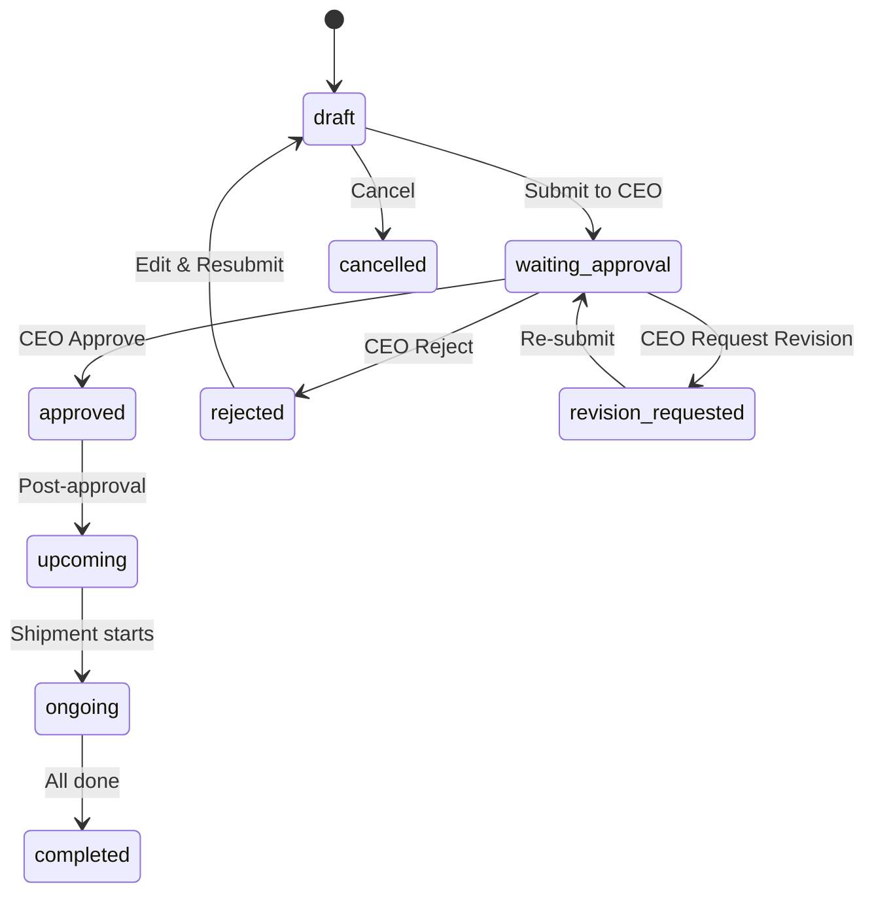

# SRS Modul 06: Forecast Sales / Projects

**Modul:** Forecast Sales
**Route:** `/forecast-sales`, `/projects`
**Versi:** 2.0
**Terakhir Diperbarui:** Juli 2026
**Implementation Status:** Partial — integrated revision adds Entity filter, custom-field rehydration, and buyer-feedback transition guard. Canonical Offer No and separate Deal record remain pending.

---

## 1. Overview

### 1.1 Deskripsi
Modul manajemen proyek penjualan **end-to-end** dengan workflow approval berjenjang. Modul terbesar kedua setelah Shipment Monitor. Mencakup pembuatan forecast, offer profile, supplier candidate comparison, embedded blending simulation, restricted rough P&L, CEO approval, FCO generation, buyer feedback, dan conversion ke shipment.

> **Rename:** Modul lama "Projects" harus diganti menjadi **Forecast Sales** di semua label produk. `/forecast-sales` adalah alias dari `/projects`.

### 1.2 Route & Dependencies
| Atribut | Nilai |
|---------|-------|
| Route | `/projects`, `/forecast-sales` (alias) |
| Store | `commercial-store` |
| Dependencies | jsPDF, useSearchParams |
| Akses | Semua role (approval: CEO/DIRUT/ASS_DIRUT only) |

---

## 2. Functional Requirements

### FR-FS-001: Rename Projects to Forecast Sales (Status: Done)
**Priority:** Very High

- Sidebar, page title, action label memakai "Forecast Sales"
- Record lama dari Projects tetap terbaca
- `/forecast-sales` = `export { default } from "../projects/page"`

**AC-FS-001**: Tidak ada label "Projects" yang tampil sebagai user-facing term baru

### FR-FS-002: Management Dashboard (Status: Done)
**Priority:** High

Metric di bagian atas modul:
- Total forecast this month
- Total draft offer
- Total submitted/CEO review
- Total approved offer
- Total FCO sent
- Total deal
- Total failed
- Pending buyer feedback
- Estimated revenue (**CEO/management only**)
- Estimated margin/P&L (**CEO/management only**)

Filter: by month, trader, buyer, status

**BR-FS-001**: Revenue dan margin restricted mengikuti role
**BR-FS-002**: Card dapat diklik menuju filtered records

### FR-FS-003: Forecast/Offer Draft and Profile (Status: Done)
**Priority:** Very High

Data minimal (30+ fields):

| Field | Type | Mandatory |
|-------|------|-----------|
| Forecast Sales ID | Auto | Yes |
| Forecast Month | Date | Yes |
| Offer/Project Name | Text | Yes |
| Trader Name | Auto (from user) | Yes |
| Buyer Name | Text | Yes |
| Buyer Country | Dropdown | Yes |
| Commodity/Product | Text | Yes |
| Quantity (MT) | Number | Yes |
| Laycan Start | Date | Yes |
| Laycan End | Date | Yes |
| Port of Loading | Text | Yes |
| Sales Term | Dropdown (FOB/CIF/CFR/FAS/custom) | Yes |
| Target Selling Price | Number | Yes |
| Price Basis | Text (Fixed/ICI/NEWC/HBA/formula/custom) | Yes |
| Payment Terms | Text | Yes |
| Surveyor | Text | Optional |
| GAR | Number | Yes |
| TM (%) | Number | Optional |
| TS (%) | Number | Optional |
| ASH (%) | Number | Optional |
| VM (%) | Number | Optional |
| Size | Text | Optional |
| Supplier Candidates | Textarea | Optional |
| Below Spec Reason | Textarea | Conditional |
| Blending Scenario | Textarea | Optional |
| Internal Notes | Textarea | Optional |
| Market Price Reference | Auto-snapshot | Yes |
| Template Type | Dropdown | Optional |
| Template Checklist | Textarea | Optional |

**BR-FS-003**: Draft dapat disimpan walau mandatory fields belum lengkap
**BR-FS-004**: Submit Offer Profile wajib semua mandatory field lengkap
**BR-FS-005**: Trader name default otomatis dari user login
**BR-FS-006**: Warning jika target selling price < market reference

### FR-FS-004: Supplier Candidate Comparison (Status: Done)
**Priority:** Very High

User dapat menambahkan beberapa supplier candidate dari Source module.

| Field per Candidate | Type |
|----|------|
| Source/Supplier | Text/Dropdown |
| Available Stock/COB | Number |
| Supplier Price (FOB) | Number |
| GAR/GCV | Number |
| TM, TS, ASH, VM, HGI | Number |
| Readiness Status | Enum |
| Notes | Text |

**BR-FS-007**: Sistem membandingkan requested spec vs candidate spec
**BR-FS-008**: Warning jika candidate di bawah spec
**BR-FS-009**: Lanjut dengan candidate di bawah spec wajib reason/acknowledgment
**BR-FS-010**: Candidate terpilih menjadi selected supplier untuk offer dan shipment

### FR-FS-005: Embedded Blending Simulation (Status: Done)
**Priority:** High

Input: selected candidates, quantity split, GAR, TM, TS, ASH, VM, price/cost per MT.
Output: final estimated spec, average cost, blended cost, pass/warning/not recommended.

**BR-FS-011**: Hasil blending dapat disimpan sebagai reference offer
**BR-FS-012**: Hasil blending tidak menggantikan QC/PSI/COA final

### FR-FS-006: Restricted Rough P&L (Status: Done)
**Priority:** High

Auto-generated setelah submit offer profile.

| Field | Source |
|-------|--------|
| Selling Price | Offer profile |
| Supplier Price | Selected candidate |
| Quantity | Offer |
| Freight Estimate | If available |
| Surveyor Cost | If set |
| Royalty/Tax/Export | If applicable |
| Other Cost | If any |
| **Estimated Revenue** | Computed |
| **Total Estimated Cost** | Computed |
| **Estimated Gross Profit** | Revenue - Cost |
| **Margin per MT** | Profit / Qty |
| **Margin %** | Profit / Revenue × 100 |

**BR-FS-013**: Hanya CEO, DIRUT, ASS_DIRUT, COO yang bisa melihat
**BR-FS-014**: Perubahan input → recalculation + revision log

### FR-FS-007: CEO Approval Workflow (Status: Done)
**Priority:** Very High

Status flow:

**BR-FS-015**: Submit diblokir jika mandatory fields belum lengkap
**BR-FS-016**: Approval/rejection/revision request wajib comment/reason
**BR-FS-017**: Approval history: user, role, timestamp, comment, status
**BR-FS-018**: FCO generation hanya setelah Approved

### FR-FS-008: FCO Generator (jsPDF) (Status: Done)
**Priority:** Very High

FCO PDF format berdasarkan contoh `FCO.C2604 (1).pdf`:

| Section | Isi |
|---------|-----|
| Header | FULL CORPORATE OFFER title, FCO number, date |
| Addressee | To/buyer, Attention/contact person |
| Declaration | Standard declaration statement |
| Commodity | Coal specification table (Parameter, Basis, Unit, Typical, Lowest Limit) |
| Origin | Origin region |
| Quantity | Quantity + tolerance |
| Laycan | Delivery period |
| Port of Loading | POL name |
| Base Price | Price basis and value |
| Price Adjustment | Formula if applicable |
| Shipping Terms | FOB/CIF/CFR clause |
| Loading Rate | Default: 8,000 MT geared/10,000 MT gearless PWWD SHINC |
| Payment Terms | As specified |
| Independent Surveyor | Surveyor name |
| Other Terms | Additional clauses |
| Validity | Offer validity period |
| Signature | Seller/company block |

**BR-FS-019**: FCO number auto-generated, unique
**BR-FS-020**: FCO PDF tidak dapat didownload sebelum status Approved
**BR-FS-021**: FCO revision membuat version baru (no overwrite)
**BR-FS-022**: FCO sent date + sent by tercatat
**BR-FS-023**: Clause template berbeda per sales term

### FR-FS-009: Buyer Feedback and Deal Result (Status: Done)
**Priority:** Very High

Status setelah FCO sent:
- FCO Sent → Waiting Buyer Feedback → Negotiation/Pending → **Deal** or **Failed**

**BR-FS-024**: Failed wajib reason (category: price/quality/laycan/payment/stock/buyer cancelled/other)
**BR-FS-025**: Failed → notification ke CEO/management
**BR-FS-026**: Deal → convert otomatis/one-click ke Shipment

### FR-FS-010: Convert Deal to Shipment (Status: Done)
**Priority:** Very High

Saat status = Deal, sistem membuat Shipment record:
- Data terbawa: buyer, commodity, quantity, spec, laycan, POL, sales price, payment term, surveyor, supplier/source, PIC trader
- Shipment ID auto-generated
- Forecast Sales menyimpan linked shipment ID
- Shipment awal = Upcoming/Draft

**AC-FS-010**: One-click convert tanpa re-input data

### FR-FS-011: Document Checklist Template (Status: Done — /api/forecasts/:id/documents GET/POST/PATCH)
**Priority:** High

Per project checklist item: Code, Label, Owner, Done (checkbox), Required, File upload, Uploaded At, Uploaded By.

### FR-FS-012: Approval History Timeline (Status: Done — /api/forecasts/:id/approvals GET)
**Priority:** High

Per entry: Status (approved/rejected/revision), Comment, User Name, Timestamp.

### FR-FS-013: Revision History (Status: Done — /api/forecasts/:id/revisions GET)
**Priority:** High

Per entry: Changes array (field, label, old value, new value), Reason, Status at change, User, Timestamp.

**BR-FS-027**: Revision log untuk perubahan target selling price, final selling price, price basis, quantity, laycan, supplier candidate, selected supplier, sales term
**BR-FS-028**: Revision setelah CEO approval → resubmission/approval rule

### FR-FS-014: Price/Laycan Revision Log (Status: Done — stored in ForecastRevision entity via /api/forecasts/:id/revision)
**Priority:** High

Old value, new value, reason, user, timestamp, approval reference.

---

## 3. Data Model

### Entity: ForecastSales (Project)

| Field | Type | Required |
|-------|------|----------|
| id | UUID | Yes |
| forecastMonth | Date | Yes |
| name | String | Yes |
| traderName | String | Yes (auto from user) |
| buyer | String | Yes |
| buyerCountry | String | Yes |
| commodity | String | Yes |
| quantity | Number | Yes |
| laycanStart | Date | Yes |
| laycanEnd | Date | Yes |
| portOfLoading | String | Yes |
| salesTerm | Enum | Yes |
| targetSellingPrice | Number | Yes |
| priceBasis | String | Yes |
| paymentTerms | String | Yes |
| surveyor | String | Optional |
| specGar | Number | Yes |
| specTm | Number | Optional |
| specTs | Number | Optional |
| specAsh | Number | Optional |
| specVm | Number | Optional |
| specSize | String | Optional |
| supplierCandidates | JSON | Optional |
| selectedSupplier | String | Optional |
| belowSpecReason | Text | Optional |
| blendingScenario | Text | Optional |
| internalNotes | Text | Optional |
| marketReference | JSON | Auto |
| status | Enum | Yes |
| fcoNumber | String | Optional |
| fcoVersion | Number | Optional |
| fcoPdfUrl | String | Optional |
| fcoSentDate | DateTime | Optional |
| fcoSentBy | String | Optional |
| buyerFeedback | Text | Optional |
| failedReason | Text | Optional |
| failedCategory | Enum | Optional |
| linkedShipmentId | FK | Optional |
| segment | Enum (local/export) | Yes |
| sourceKind | Enum (master/derived) | Yes |
| roughPl | JSON | Optional |
| createdAt | DateTime | Yes |
| updatedAt | DateTime | Yes |

### Entity: ForecastApproval

| Field | Type |
|-------|------|
| id | UUID |
| forecastSalesId | FK |
| status | Enum |
| comment | Text |
| userName | String |
| userId | FK |
| createdAt | DateTime |

### Entity: ForecastRevision

| Field | Type |
|-------|------|
| id | UUID |
| forecastSalesId | FK |
| changes | JSON |
| reason | Text |
| statusAtChange | String |
| userName | String |
| userId | FK |
| createdAt | DateTime |

### Entity: FCO

| Field | Type |
|-------|------|
| id | UUID |
| forecastSalesId | FK |
| fcoNumber | String |
| version | Number |
| action | Enum (generate/regenerate) |
| pdfUrl | String |
| generatedAt | DateTime |
| generatedBy | String |

---

## 4. API Endpoints

| Method | Endpoint |
|--------|----------|
| GET | `/api/forecast-sales` |
| GET | `/api/forecast-sales/:id` |
| POST | `/api/forecast-sales` |
| PUT | `/api/forecast-sales/:id` |
| DELETE | `/api/forecast-sales/:id` |
| POST | `/api/forecast-sales/:id/submit` |
| POST | `/api/forecast-sales/:id/approve` |
| POST | `/api/forecast-sales/:id/reject` |
| POST | `/api/forecast-sales/:id/request-revision` |
| POST | `/api/forecast-sales/:id/generate-fco` |
| POST | `/api/forecast-sales/:id/convert-shipment` |
| GET | `/api/forecast-sales/:id/approvals` |
| GET | `/api/forecast-sales/:id/revisions` |
| GET | `/api/forecast-sales/:id/documents` |
| POST | `/api/forecast-sales/:id/documents` |

---

## 5. Role & Permission

| Action | CEO | C-Level | Trader | Source | Quality |
|--------|-----|---------|--------|--------|---------|
| View | ✅ | ✅ | ✅ (own) | ✅ Read | ✅ Read |
| Create/Edit | ❌ | ❌ | ✅ | ❌ | ❌ |
| Submit | ❌ | ❌ | ✅ | ❌ | ❌ |
| Approve/Reject | ✅ | ❌ | ❌ | ❌ | ❌ |
| Generate FCO | ❌ | ❌ | ✅ (after approved) | ❌ | ❌ |
| View Rough P&L | ✅ | ✅ (COO) | ❌ | ❌ | ❌ |
| Convert to Shipment | ❌ | ❌ | ✅ | ❌ | ❌ |

---

## 6. Integration Points

| Modul | Hubungan |
|-------|----------|
| Dashboard | Waiting Approval widget, AI Urgency Panel |
| Shipment Monitor | Project → Shipment conversion |
| Sales Monitor | Deal tracking per project |
| Sources | Supplier candidates reference |
| Blending | Blending scenario per project |
| Market Price | Target price reference, market snapshot |

---

*End of SRS_06_Forecast_Sales*
